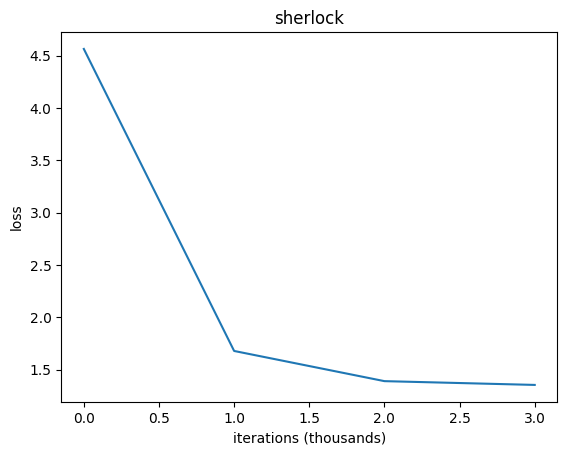

# Text Predictor
Character-level **RNN** (Recurrent Neural Net) **LSTM** (Long Short-Term Memory) implemented in Python 3.6.7/TensorFlow in order to predict a text based on a given dataset. 

 

Check out corresponding Medium article:

[Text Predictor - Generating Rap Lyrics with Recurrent Neural Networks (LSTMs)📄](https://towardsdatascience.com/text-predictor-generating-rap-lyrics-with-recurrent-neural-networks-lstms-c3a1acbbda79)

---

Heavily influenced by: [http://karpathy.github.io/2015/05/21/rnn-effectiveness/]() and [https://github.com/gsurma/password_cracker]().

## Idea
1. Train RNN LSTM  on a given dataset (.txt file).
2. Predict text based on a trained model.

## Datasets
	kanye - Kanye West's discography (332 KB)
	darwin - the complete works of Charles Darwin (20 MB)
	reuters - a collection of Reuters headlines (95 MB)
	war_and_peace - Leo Tolstoy's War and Peace novel (3 MB)
	wikipedia - excerpt from English Wikipedia (48 MB) 
	hackernews - a collection of Hackernews headlines (90 KB)
	sherlock - a collection of books with Sherlock Holmes (3 MB)
	shakespeare - the complete works of William Shakespeare (4 MB)
	tagore - short stories by Rabindranath Tagore (2.6 MB)
Feel free to add new datasets. Just create a folder in the `./data` directory and put an `input.txt` file there. Output file along with the training plot will be automatically generated there.
	
	
## Usage
1. Clone the repo.
2. Go to the project's root folder.
3. Install required packages`pip install -r requirements.txt`.
4. `python text_predictor.py <dataset>`.

## Results

Each dataset were trained with the same hyperparameters.

**Hyperparameters**
	BATCH_SIZE = 32
	SEQUENCE_LENGTH = 50
	LEARNING_RATE = 0.01
	DECAY_RATE = 0.97
	HIDDEN_LAYER_SIZE = 256
	CELLS_SIZE = 2

### Sherlock

Iteration: **0**

	 l é°£I." r, iEgPylXyg
	m .iüTû  Ccy2M]zTâ.  sSRM£t é5 ’îRlT QAlY4Kv"é)kP£Str5/lQVu )Pe0/;s8leJ.£m40tîJîwB`0]½jyûA`BJi'omNx½2zG iH:gqri76b&g)ie18PM£vA7pßKâNQ6
	2 û?]wg£Jo4qCde,’.'G,h &wIUaDuîxq`cqb!kf5yB

 

Iteration: **500**

	"Other. I
	     unwallfore of his had Sommopilor out he hase you thed I it.
	
	     Book into here, but I told at ht it something do was sack knet afminture-ly. We moke, do oR before drinessast farm. I
 

 

Iteration: **1000**

   	some to see me tignaius
     rely."
	
     There that you'd them were from I
     should not have any take an watchate save now out," said Hodden?"
	
     "Th, a lott remarks. Showed."
	
     "A joan?"
     
     
 

Iteration: **100000**

 	Then mention.""Quite
     I gather is stillar in silence was written on the whom I reward an
     details grieves of his east back. The week shook this strength.
     There was no mystery for y

 

